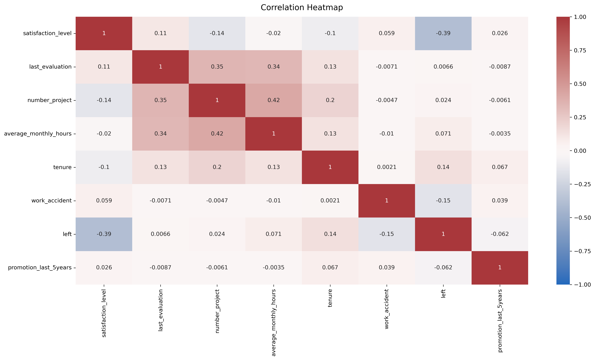
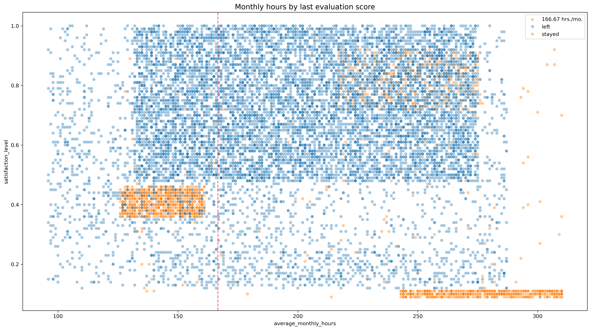
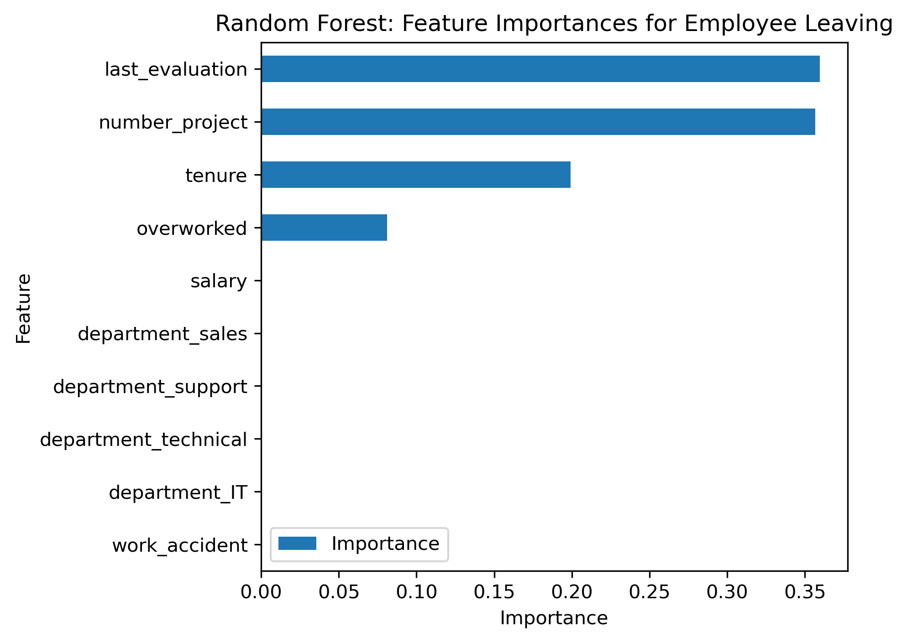

# 📊 HR Employee Attrition Prediction

Predicting employee attrition using machine learning and exploratory data analysis.

---

## 📌 Project Overview

Employee turnover is one of the most expensive challenges for organizations. Recruiting, hiring, and onboarding new employees require significant time and financial resources.

In this project, I analyzed HR data from Salifort Motors to identify the main factors associated with employee attrition and developed machine learning models capable of predicting whether an employee is likely to leave the company.

---

## 🎯 Business Problem

The Human Resources department wants to answer one key question:

> **Which employees are most likely to leave the company?**

The goal is to identify the drivers of employee turnover and provide actionable recommendations that help improve employee retention.

---

## 📂 Dataset

**Source**

Google Advanced Data Analytics Capstone Project

Dataset contains **14,999 employee records** with information such as:

- Satisfaction level
- Last evaluation
- Number of projects
- Average monthly hours
- Tenure
- Work accident
- Promotion history
- Department
- Salary level
- Employee attrition

Target variable:

**left**

- 0 = Employee stayed
- 1 = Employee left

---

## 🛠️ Technologies

- Python
- Pandas
- NumPy
- Matplotlib
- Seaborn
- Scikit-learn
- XGBoost

---

## 📈 Project Workflow

### 1. Data Cleaning

- Renamed columns
- Removed duplicate records
- Checked missing values
- Detected outliers

### 2. Exploratory Data Analysis

Performed analysis of:

- Employee satisfaction
- Working hours
- Project workload
- Tenure
- Salary
- Department
- Correlations

### 3. Feature Engineering

Created a new feature:

- **Overworked**

to reduce potential data leakage while preserving information about excessive workload.

### 4. Machine Learning

Implemented and compared:

- Logistic Regression
- Decision Tree
- Random Forest

---

## 📊 Key Visualizations

### Correlation Heatmap



---

### Satisfaction vs Monthly Hours



---

### Feature Importance



---

## 🏆 Model Performance

| Model | Accuracy | Precision | Recall | AUC |
|--------|----------|-----------|--------|------|
| Logistic Regression | 83% | 80% | 83% | — |
| Decision Tree | 96.2% | 87.0% | 90.4% | 0.938 |
| Random Forest | **Best Overall** | **Highest Overall Performance** | | |

---

## 🔍 Key Findings

The strongest predictors of employee attrition were:

- Last evaluation
- Number of projects
- Tenure
- Overworked status

Employees who worked excessive hours and managed many projects were significantly more likely to leave the company.

---

## 💡 Business Recommendations

Based on the analysis, the HR department should consider:

- Limiting the number of simultaneous projects
- Monitoring excessive overtime
- Improving promotion opportunities
- Reviewing employee workload distribution
- Investigating dissatisfaction among employees with approximately four years of tenure

---

## 📁 Repository Structure

```
HR-Employee-Attrition-Prediction/
│
├── data/
│   └── HR_capstone_dataset.csv
│
├── notebooks/
│   └── HR_Employee_Attrition.ipynb
│
├── images/
│   ├── correlation_heatmap.png
│   ├── confusion_matrix.png
│   ├── feature_importance.png
│   └── hours_vs_satisfaction.png
│
├── README.md
│
├── requirements.txt
│
└── .gitignore
```

---

## 🚀 Future Improvements

- Experiment with XGBoost and LightGBM
- Perform SHAP analysis for model explainability
- Deploy the model using Streamlit
- Build an interactive HR dashboard in Power BI
